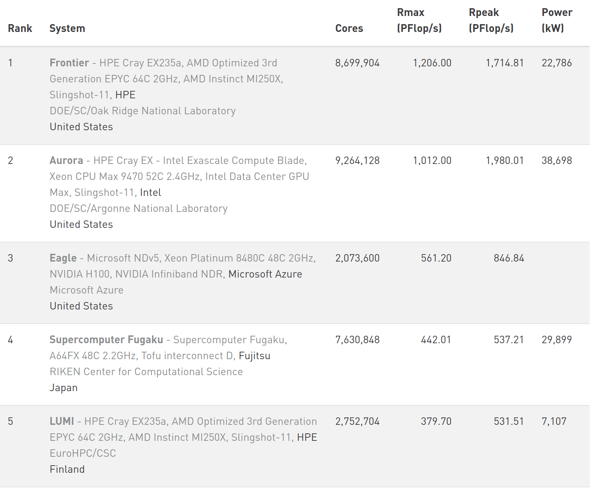

.. _gpu-history:

Why GPUs?
=========

.. questions::

   - What is Moore's law?
   - What problem do GPUs solve?

.. objectives::

   - Explain the historical development of microprocessors and how GPUs enable 
     continued scaling in computational power

.. instructor-note::

   - 15 min teaching
   - 0 min exercises

Moore's law
-----------

It states that the number of transistors in a dense integrated circuit doubles about every two years.
More transistors means smaller size of a single element, so higher core frequency can be achieved.
However, power consumption scales with frequency to the third power, therefore the growth in the core frequency has slowed down significantly.
Higher performance of a single node has to rely on its more complicated structure and still can be achieved with SIMD (single instruction multiple data), branch prediction, etc.

.. figure:: img/history/microprocessor-trend-data.png
   :align: center

   The evolution of microprocessors.
   The number of transistors per chip increase roughly every 2 years.
   However, it can no longer be explored by the core frequency due to the power consumption limits.
   Before 2000, the increase in the single core clock frequency was the major source of the 
   increase in the performance. Mid 2000 mark a transition towards multi-core processors.

Increasing performance has been sustained with two main strategies over the years:

    - Increase the single processor performance: 
    - More recently, increase the number of physical cores.

Computing in parallel
---------------------

The underlying idea of parallel computing is to split a computational problem into smaller 
subtasks. Many subtasks can then be solved *simultaneously* by multiple processing units. 

.. figure:: img/history/compp.png
   :align: center
   
   Computing in parallel.

How a problem is split into smaller subtasks strongly depends on the problem. 
There are various paradigms and programming approaches to do this. 

Graphics processing units
-------------------------

Graphics processing units (GPU) have been the most common accelerators during the last few years, the term GPU sometimes is used interchangeably with the term *accelerator*.
GPUs were initially developed for highly-parallel task of graphic processing.
But over the years, they were used more and more in HPC.

GPUs are a specialized parallel hardware for floating point operations.
They are basically co-processors (helpers) for traditional CPUs: CPU still controls the work flow
but it delegates highly-parallel tasks to the GPU.
GPUs are based on highly parallel architectures, which allows taking advantage of the 
increasing number of transistors.

Using GPUs allows one to achieve extreme performance per node.
As a result, the single GPU-equipped workstation can outperform small CPU-based clusters 
for some type of computational tasks. The drawback is: usually major rewrites of programs is required
with an accompanying change in the programming paradigm.

.. callout:: Host vs device

   GPU-enabled systems require a heterogeneous programming model that involves both 
   CPU and GPU, where the CPU and its memory are referred to as the host, 
   and the GPU and its memory as the device.

.. figure:: img/history/CPU_and_GPU_separated.png
   :align: center

   Figure adapted from the Carpentry `GPU Programming lesson <https://carpentries-incubator.github.io/lesson-gpu-programming/>`__.

A look at the Top-500 list
--------------------------

The `TOP500 project <https://www.top500.org/>`__ ranks and details the 500 most powerful non-distributed computer systems in the world. The project was started in 1993 and publishes an updated list of the supercomputers twice a year. The snapshot below shows the top-5 HPC systems as of June 2023, where the columns show:

- **Cores** - Number of processors 
- **Rmax** - Maximal LINPACK performance achieved
- **Rpeak** - Theoretical peak performance
- **Power** - Power consumption

   Snapshot from the `Top500 list from June, 2023 <https://www.top500.org/lists/top500/2023/06/>`__.

All systems in the top-5 positions contain GPUs from AMD or NVIDIA, except for Fugaku which instead relies on custom-built Arm A64FX CPUs.

Why GPUs?
---------

Speed
^^^^^

GPU computing can significantly accelerate many types of scientific workloads.

Improved energy efficiency
^^^^^^^^^^^^^^^^^^^^^^^^^^

Compared to CPUs, GPUs can perform more calculations per watt of power consumed, 
which can result in significant energy savings. This is indeed evident from the `Green500 list <https://www.top500.org/lists/green500/2023/06/>`__.

Cost-effectiveness 
^^^^^^^^^^^^^^^^^^

GPUs can be more cost-effective than traditional CPU-based systems for certain 
workloads.

Limitations and drawbacks
-------------------------

Only for certain workloads
^^^^^^^^^^^^^^^^^^^^^^^^^^

Not all workloads can be efficiently parallelized and accelerated on GPUs. 
Certain types of workloads, such as those with irregular data access patterns or 
high branching behavior, may not see significant performance improvements on GPUs.

Steeper learning curve
^^^^^^^^^^^^^^^^^^^^^^

Depending on the GPU programming API that you choose, GPU computing could 
require specialized skills in GPU programming and knowledge of 
GPU architecture, leading to a steeper learning curve compared to CPU programming. 
Fortunately, if you study this training material closely you will become productive 
with GPU programming quickly!

.. keypoints::

   - GPUs are accelerators for some types of tasks
   - Highly parallilizable compute-intensive tasks are suitable for GPUs
   - New programming skills are needed to use GPUs efficiently
