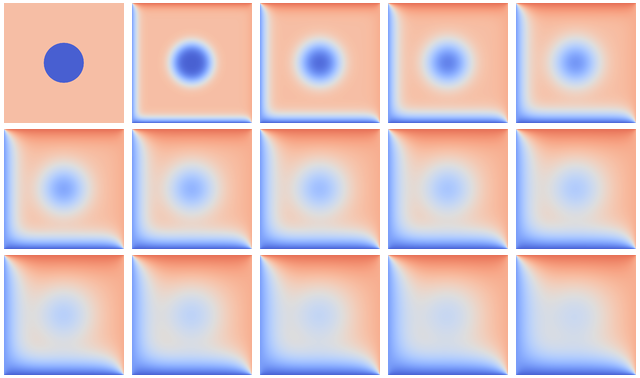

.. _example-heat:

GPU programming example: stencil computation
============================================

.. questions::

   - q1
   - q2

.. objectives::

   - To show a self-contained example of parallel computation executed on CPU (via OpenMP) and GPU (different models)
   - To show differences of implementing the same procedure in natural "style" of different models/ frameworks

.. instructor-note::

   - 40 min teaching
   - 40 min exercises

Problem: heat flow in two-dimensional area
~~~~~~~~~~~~~~~~~~~~~~~~~~~~~~~~~~~~~~~~~~

Heat flows in objects according to local temperature differences, as if seeking local equilibrium. The following example defines a rectangular area with two always-warm sides (temperature 70 and 85), two cold sides (temperature 20 and 5) and a cold disk at the center. Because of heat diffusion, temperature of neighboring patches of the area is bound to equalize, changing the overall distribution:

   
   Over time, the temperature distribution progresses from the initial state toward an end state where upper triangle is warm and lower is cold. The average temperature tends to (70 + 85 + 20 + 5) / 4 = 45.

Technique: stencil computation
~~~~~~~~~~~~~~~~~~~~~~~~~~~~~~

Heat transfer in the system above is governed by the partial differential equation(s) describing local variation of the temperature field in time and space. That is, the rate of change of the temperature field :math:`u(x, y, t)` over two spatial dimensions :math:`x` and :math:`y` and time :math:`t` (with rate coefficient :math:`\alpha`) can be modelled via the equation

.. math::
   \frac{\partial u}{\partial t} = \alpha \left( \frac{\partial^2 u}{\partial x^2} + \frac{\partial^2 u}{\partial x^2}\right)
   
The standard way to numerically solve differential equations is to *discretize* them, i. e. to consider only a set/ grid of specific area points at specific moments in time. That way, partial derivatives :math:`{\partial u}` are converted into differences between adjacent grid points :math:`u^{m}(i,j)`, with :math:`m, i, j` denoting time and spatial grid points, respectively. Temperature change in time at a certain point can now be computed from the values of neighboring points at earlier time; the same expression, called *stencil*, is applied to every point on the grid.

.. figure:: img/stencil/stencil.svg
   :align: center

   This simplified model uses an 8x8 grid of data in light blue in state
   :math:`m`, each location of which has to be updated based on the
   indicated 5-point stencil in yellow to move to the next time point
   :math:`m+1`.

Stencil computation is a common occurrence in solving numerical equations, image processing (for 2D convolution) and other areas.

.. solution:: Stencil expression and time-step limit
   
   Differential equation shown above can be discretized using different schemes. For this example, temperature values at each grid point :math:`u^{m}(i,j)` are updated from one time point (:math:`m`) to the next (:math:`m+1`), using the following expressions:
      
   .. math::
       u^{m+1}(i,j) = u^m(i,j) + \Delta t \alpha \nabla^2 u^m(i,j) ,
   
   where
   
   .. math::
      \nabla^2 u  &= \frac{u(i-1,j)-2u(i,j)+u(i+1,j)}{(\Delta x)^2} \\
          &+ \frac{u(i,j-1)-2u(i,j)+u(i,j+1)}{(\Delta y)^2} ,
   
   and :math:`\Delta x`, :math:`\Delta y`, :math:`\Delta t` are step sizes in space and time, respectively.
   
   Time-update schemes also have a limit on the maximum allowed time step :math:`\Delta t`. For the current scheme, it is equal to
   
   .. math::
      \Delta t_{max} = \frac{(\Delta x)^2 (\Delta y)^2}{2 \alpha ((\Delta x)^2 + (\Delta y)^2)}

Technical considerations
------------------------

**1. How fast and/ or accurate can the solution be?**

Spatial resolution of the temperature field is controlled by the number/ density of the grid points. As the full grid update is required to proceed from one time point to the next, stencil computation is the main target of parallelization (on CPU or GPU).

Moreover, in many cases the chosen time step cannot be arbitrarily large, otherwise the numerical differentiation will fail, and dense/ accurate grids imply small time steps (see inset above), which makes efficient spatial update even more important.

**2. What to do with area boundaries?**

Naturally, stencil expression can't be applied directly to the outermost grid points that have no outer neighbors. This can be solved by either changing the expression for those points or by adding an additional layer of grid that is used in computing update, but not updated itself -- points of fixed temperature for the sides are being used in this example.

CPU parallelization (with OpenMP)
~~~~~~~~~~~~~~~~~~~~~~~~~~~~~~~~~

Intro: WRITEME

.. tabs::

   .. tab:: Stencil update

         .. literalinclude:: examples/stencil/base/core.cpp 
                        :language: cpp
                        :emphasize-lines: 25

   .. tab:: Main function

         .. literalinclude:: examples/stencil/base/main.cpp 
                        :language: cpp
                        :emphasize-lines: 37
 
   .. tab:: Default params

         .. literalinclude:: examples/stencil/base/heat.h 
                        :language: cpp
                        :lines: 7-34

Comments, exercise and some test numbers: WRITEME

GPU parallelization: first steps
~~~~~~~~~~~~~~~~~~~~~~~~~~~~~~~~

Intro: WRITEME

.. tabs::

   .. tab:: OpenMP

         .. literalinclude:: examples/stencil/base/core-omp.cpp 
                        :language: cpp
                        :emphasize-lines: 24-26
         
   .. tab:: SYCL

         .. literalinclude:: examples/stencil/sycl/core-naive.cpp 
                        :language: cpp
                        :emphasize-lines: 31,35
                        
   .. tab:: Python

         .. literalinclude:: examples/stencil/python/heat_core.py 
                        :language: py
                        :lines: 6-8,34-48
         
   .. tab:: Julia

         WRITEME  

   .. tab:: CUDA

         WRITEME  

For kernel-based models, the approach above is grossly inefficient.
On each step, we re-allocate GPU memory, copy the data from CPU to GPU, perform the computation, and then copy the data back.
It will make such GPU version much slower than the original CPU version, but is a helpful first step in the porting process.
But overhead can be reduced with some modifications to the structure of the program:

- allocate GPU memory once at the start of the program,
- only copy the data from GPU to CPU when we need it,
- swap the GPU buffers between timesteps, like we do with CPU buffers.

.. tabs::

   .. tab:: SYCL: Stencil update

         .. literalinclude:: examples/stencil/sycl/core.cpp
                        :language: cpp
                        :emphasize-lines: 13-14,28-29

   .. tab:: SYCL: Main function

         .. literalinclude:: examples/stencil/sycl/main.cpp 
                        :language: cpp
                        :emphasize-lines: 13-27,53-55,65,70,72

Exercises and discussion on comparison/ optimization perspectives: WRITEME

See-also: WRITEME

.. keypoints::

   - k1
   - k2

