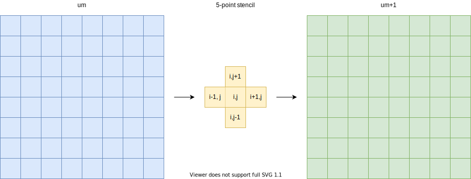

.. _example-heat:

GPU programming example: stencil computation
============================================

.. questions::

   - q1
   - q2

.. objectives::

   - To show a self-contained example of parallel computation executed on CPU (via OpenMP) and GPU (different models)
   - To show differences of implementing the same procedure in natural "style" of different models/ frameworks

.. instructor-note::

   - 40 min teaching
   - 40 min exercises

Problem: heat flow in two-dimensional area
~~~~~~~~~~~~~~~~~~~~~~~~~~~~~~~~~~~~~~~~~~

Heat flows in objects according to local temperature differences, as if seeking local equilibrium. The following example defines a rectangular area with two always-warm sides (temperature 70 and 85), two cold sides (temperature 20 and 5) and a cold disk at the center. Because of heat diffusion, temperature of neighboring patches of the area is bound to equalize, changing the overall distribution:

.. figure:: img/stencil/heat_montage.png
   :align: center
   
   Over time, the temperature distribution progresses from the initial state toward an end state where upper triangle is warm and lower is cold. The average temperature tends to (70 + 85 + 20 + 5) / 4 = 45.

Technique: stencil computation
~~~~~~~~~~~~~~~~~~~~~~~~~~~~~~

Heat transfer in the system above is governed by the partial differential equation(s) describing local variation of the temperature field in time and space. That is, the rate of change of the temperature field :math:`u(x, y, t)` over two spatial dimensions :math:`x` and :math:`y` and time :math:`t` (with rate coefficient :math:`\alpha`) can be modelled via the equation

.. math::
   \frac{\partial u}{\partial t} = \alpha \left( \frac{\partial^2 u}{\partial x^2} + \frac{\partial^2 u}{\partial x^2}\right)
   
The standard way to numerically solve differential equations is to *discretize* them, i. e. to consider only a set/ grid of specific area points at specific moments in time. That way, partial derivatives :math:`{\partial u}` are converted into differences between adjacent grid points :math:`u^{m}(i,j)`, with :math:`m, i, j` denoting time and spatial grid points, respectively. Temperature change in time at a certain point can now be computed from the values of neighboring points at earlier time; the same expression, called *stencil*, is applied to every point on the grid.

   This simplified model uses an 8x8 grid of data in light blue in state
   :math:`m`, each location of which has to be updated based on the
   indicated 5-point stencil in yellow to move to the next time point
   :math:`m+1`.

.. challenge:: Discussion: stencil applications

   Stencil computation is a common occurrence in solving numerical problems. Have you already encountered it? Can you think of a problem that could be formulated this way in your field / area of expertise?
   
   .. solution::
      
      One obvious choice is *convolution* operation, used in image processing to apply various filter kernels; in some contexts, "convolution" and "stencil" are used almost interchangeably.

.. solution:: Stencil expression and time-step limit
   
   Differential equation shown above can be discretized using different schemes. For this example, temperature values at each grid point :math:`u^{m}(i,j)` are updated from one time point (:math:`m`) to the next (:math:`m+1`), using the following expressions:
      
   .. math::
       u^{m+1}(i,j) = u^m(i,j) + \Delta t \alpha \nabla^2 u^m(i,j) ,
   
   where
   
   .. math::
      \nabla^2 u  &= \frac{u(i-1,j)-2u(i,j)+u(i+1,j)}{(\Delta x)^2} \\
          &+ \frac{u(i,j-1)-2u(i,j)+u(i,j+1)}{(\Delta y)^2} ,
   
   and :math:`\Delta x`, :math:`\Delta y`, :math:`\Delta t` are step sizes in space and time, respectively.
   
   Time-update schemes also have a limit on the maximum allowed time step :math:`\Delta t`. For the current scheme, it is equal to
   
   .. math::
      \Delta t_{max} = \frac{(\Delta x)^2 (\Delta y)^2}{2 \alpha ((\Delta x)^2 + (\Delta y)^2)}

Technical considerations
------------------------

**1. How fast and/ or accurate can the solution be?**

Spatial resolution of the temperature field is controlled by the number/ density of the grid points. As the full grid update is required to proceed from one time point to the next, stencil computation is the main target of parallelization (on CPU or GPU).

Moreover, in many cases the chosen time step cannot be arbitrarily large, otherwise the numerical differentiation will fail, and dense/ accurate grids imply small time steps (see inset above), which makes efficient spatial update even more important.

**2. What to do with area boundaries?**

Naturally, stencil expression can't be applied directly to the outermost grid points that have no outer neighbors. This can be solved by either changing the expression for those points or by adding an additional layer of grid that is used in computing update, but not updated itself -- points of fixed temperature for the sides are being used in this example.

**3. How could the algorithm be optimized further?**

In `an earlier episode <https://enccs.github.io/gpu-programming/9-non-portable-kernel-models/#memory-optimizations>`_, importance of efficient memory access was already stressed. In the following examples, each grid point (and its neighbors) will be treated mostly independently; however, this also means that for 5-point stencil each value of the grid point may be read up to 5 times from memory (even if it's the fast GPU memory). By rearranging the order of mathematical operations, it may be possible to reuse these values in a more efficient way.

Another point to note is that even if the solution is propagated in small time steps, not every step might actually be needed for output. Once some *local* region of the field is updated, mathematically nothing prevents it from being updated for the second time step -- even if the rest of the field is still being recalculated -- as long as :math:`t = m-1` values for the region boundary are there when needed. (Of course, this is more complicated to implement and would only give benefits in certain cases.)

Sequential and thread-parallel program in C++
~~~~~~~~~~~~~~~~~~~~~~~~~~~~~~~~~~~~~~~~~~~~~

.. callout:: Trying out code examples

   Source files of the examples presented for the rest of this episode are available in the `content/examples/stencil/ <https://github.com/ENCCS/gpu-programming/tree/main/content/examples/stencil/>`_ directory.
   To download them to your home directory on the cluster, you can use Git:
   
   .. code-block:: console

      $ git clone https://github.com/ENCCS/gpu-programming.git
      $ cd gpu-programming/content/examples/stencil/
      $ ls

   .. warning::

      Don't forget to `git pull` for the latest updates if you already have the content from the first day of the workshop!

If we assume the grid point values to be truly independent *for a single time step*, stencil application procedure may be straighforwardly written as a loop over the grid points, as shown below in tab "Stencil update". (General structure of the program and the default parameter values for the problem model are also provided for reference.) CPU-thread parallelism can then be enabled by a single OpenMP `#pragma`:

.. tabs::

   .. tab:: Stencil update

         .. literalinclude:: examples/stencil/base/core.cpp 
                        :language: cpp
                        :emphasize-lines: 25

   .. tab:: Main function

         .. literalinclude:: examples/stencil/base/main.cpp 
                        :language: cpp
                        :emphasize-lines: 37
 
   .. tab:: Default params

         .. literalinclude:: examples/stencil/base/heat.h 
                        :language: cpp
                        :lines: 7-34

.. solution:: Optional: compiling the executables and running OpenMP-CPU tests

   Executable files for the OpenMP-enabled variants are provided together with the source code. However, if you'd like to compile them yourself, follow the instructions below:
   
   .. code-block:: console

      module load LUMI/22.08
      module load partition/G
      module load rocm/5.3.3
      
      cd base/
      make all
   
   Afterwards login into an interactive node and test the executables:
   
   .. code-block:: console

      srun --account=project_465000485 --partition=standard-g --nodes=1 --cpus-per-task=1 --ntasks-per-node=1 --gpus-per-node=1 --time=1:00:00 --pty bash
      ./stencil
      ./stencil_off
      ./stencil_data
      exit
      
   If everything works well, the output should look similar to this:
   
   .. code-block:: console

      $ ./stencil
      Average temperature, start: 59.763305
      Average temperature at end: 59.281239
      Control temperature at end: 59.281239
      Iterations took 1.395 seconds.
      $ ./stencil_off
      Average temperature, start: 59.763305
      Average temperature at end: 59.281239
      Control temperature at end: 59.281239
      Iterations took 4.269 seconds.
      $ ./stencil_data   
      Average temperature, start: 59.763305
      Average temperature at end: 59.281239
      Control temperature at end: 59.281239
      Iterations took 1.197 seconds.
      $ 

   Changing number of default OpenMP threads is somewhat tricky to do interactively, so OpenMP-CPU "scaling" tests are done via provided batch script
   (make sure there is no running interactive allocation at the time):
   
     .. code-block:: console

      $ sbatch test-omp.slurm
      (to see the job status, enter command below)
      $ squeue --me
      (job should finish in a couple of minutes; let's also minimize extraneous output)
      $ more job.o<job ID> | grep Iterations
    
   The expected output is:
   
   .. code-block:: console
   
      Iterations took 1.390 seconds.
      Iterations took 13.900 seconds.
      Iterations took 0.194 seconds.
      Iterations took 1.728 seconds.
      Iterations took 0.069 seconds.
      Iterations took 0.547 seconds.
      (... 18 lines in total ...)

CPU parallelization: timings
----------------------------

GPU parallelization: first steps
~~~~~~~~~~~~~~~~~~~~~~~~~~~~~~~~

Intro: WRITEME

.. tabs::

   .. tab:: OpenMP

         .. literalinclude:: examples/stencil/base/core-off.cpp 
                        :language: cpp
                        :emphasize-lines: 25-26
         
   .. tab:: SYCL

         .. literalinclude:: examples/stencil/sycl/core-naive.cpp 
                        :language: cpp
                        :emphasize-lines: 31,35
                        
   .. tab:: Python

         .. literalinclude:: examples/stencil/python/heat_core.py 
                        :language: py
                        :lines: 6-8,34-48
         
   .. tab:: Julia

         WRITEME  

   .. tab:: CUDA

         .. literalinclude:: examples/stencil/cuda/core_cuda.cu 
                        :language: cpp
                        :lines: 1-61
                        :emphasize-lines: 22-25, 51-60

GPU parallelization: data movement
~~~~~~~~~~~~~~~~~~~~~~~~~~~~~~~~~~

For kernel-based models, the approach above is grossly inefficient.
On each step, we re-allocate GPU memory, copy the data from CPU to GPU, perform the computation, and then copy the data back.
It will make such GPU version much slower than the original CPU version, but is a helpful first step in the porting process.
But overhead can be reduced with some modifications to the structure of the program:

- allocate GPU memory once at the start of the program,
- only copy the data from GPU to CPU when we need it,
- swap the GPU buffers between timesteps, like we do with CPU buffers.

.. tabs::

   .. tab:: OpenMP: Stencil update

         .. literalinclude:: examples/stencil/base/core-data.cpp
                        :language: cpp
                        :emphasize-lines: 25,40-75
   
   .. tab:: SYCL: Stencil update

         .. literalinclude:: examples/stencil/sycl/core.cpp
                        :language: cpp
                        :emphasize-lines: 13-14,27-28,41-55

   .. tab:: SYCL: Main function

         .. literalinclude:: examples/stencil/sycl/main.cpp 
                        :language: cpp
                        :emphasize-lines: 38-39,44-45,51,56,59,75

Exercises and discussion on comparison/ optimization perspectives: WRITEME

See-also: WRITEME

.. keypoints::

   - k1
   - k2

