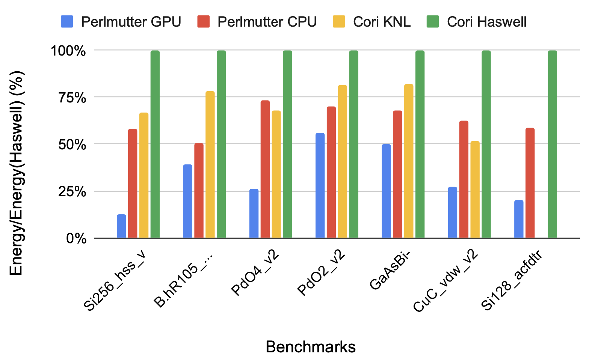

.. _gpu-problems:

What problems fit to GPU?
=========================

.. questions::

   - What are the strengths and weaknesses of GPUs?
   - What makes a particular problem suitable for GPU-porting?
   - Why are GPUs so ubiquitous in machine learning applications?

.. objectives::

   - Get a feeling for the type of use cases that GPUs excel at.

.. instructor-note::

   - 10 min teaching
   - 10 min exercises

What are GPUs good for
----------------------

Answer from `Stack Exchange <https://scicomp.stackexchange.com/questions/943/what-kinds-of-problems-lend-themselves-well-to-gpu-computing>`__:

   *From a metaphorical point of view, the GPU can be seen as a person lying on a bed 
   of nails. The person lying on top is the data and in the base of each nail there 
   is a processor, so the nail is actually an arrow pointing from processor to memory. 
   All nails are in a regular pattern, like a grid. If the body is well spread, 
   it feels good (performance is good), if the body only touches some spots of the 
   nail bed, then the pain is bad (bad performance).*

GPU computing is well-suited to problems that involve large amounts of data parallelism. 
Specifically, you can expect good performance on GPUs for:

- **Large-scale matrix and vector operations**: Common in machine learning, scientific computing, and image processing.
- **Fourier transforms**: Also common in machine learning, scientific computing, and image processing.
- **Monte Carlo simulations**: Used across finance, physics, and other fields to simulate complex systems.
- **Molecular dynamics simulations**: Used in chemistry, biochemistry and physics.
- **Computational fluid dynamics**: Used in engineering, physics, and other fields.
- **Convolutional neural networks** and **computer vision algorithms**.
- **Big data analytics**: Clustering, classification, regression, etc.
- **Graphics rendering**: Original use-case for GPUs.

What are GPUs not good for
--------------------------

Not all programming problems can efficiently leverage the parallelism offered by GPUs. 
Some types of problems that do not fit well on a GPU include:

- **Sequential tasks**: Problems that require a series of dependent steps, 
  where each step relies on the outcome of the previous step, are not well-suited 
  for parallel processing. Examples include recursive algorithms, certain dynamic 
  programming problems, and some graph traversal algorithms.

- **Fine-grained branching**: GPUs perform best when the code being executed across 
  different threads follows a similar control flow. When there is extensive 
  branching (i.e., many ``if`` statements) within a kernel or algorithm, performance 
  may suffer due to the divergence in execution paths among the GPU threads.

- **Low arithmetic intensity**: GPUs excel at performing a large number of mathematical 
  operations quickly. If a problem has low arithmetic intensity (i.e., a low ratio of 
  arithmetic operations to memory accesses), the GPU may not be able to efficiently utilize 
  its computational power, leading to underperformance.

- **Small data sets**: If the problem involves a small data set that does not require significant 
  parallelism, using a GPU may not result in noticeable performance gains. In such cases, 
  the overhead of transferring data between the CPU and GPU, and the time spent initializing the GPU, 
  may outweigh any potential benefits.

- **Limited parallelism**: Some algorithms have inherent limitations on the degree of parallelism that can be 
  achieved. In these cases, using a GPU may not lead to significant performance improvements.

- **Memory-bound problems**: GPUs generally have less memory available compared to CPUs, and their memory bandwidth 
  can be a limiting factor. If a problem requires a large amount of memory or involves memory-intensive operations, 
  it may not be well-suited for a GPU.

Examples of GPU acceleration
----------------------------

To give a flavor of what type of performance gains we can achieve by porting a calculations to a GPU 
(if we're lucky!), let's look at a few case examples.

.. discussion:: Effect of array size
   
   Consider the case of matrix multiplication in the Julia language:

   .. code-block:: julia

      using AMDGPU
      using BenchmarkTools

      N = [9, 10, 11, 12]

      for n in N
         A = rand(2^n, 2^n); A_d = ROCArray(A);

         @btime $A * $A;

         @btime begin
            $A_d * $A_d;
            AMDGPU.synchronize()
         end         
      end

   - How much faster do you think the GPU version is compared to running on a single CPU core? 
   - Julia automatically parallelises matrix multiplication over available CPU cores. Will the GPU version be faster than running on 64 cores?
   - Does the size of the array affect how much the performance improves?

   .. solution::

      Example results from running on LUMI (MI250X AMD GPU, 64-core AMD Trento CPUs):

      .. list-table:: GPU acceleration for matrix multiply in Julia
         :widths: 25 25 25 25 25
         :header-rows: 1
      
         * - Matrix size
           - 1 CPU core
           - 64 CPU cores
           - 1 GPU
           - GPU speedup
         * - (512, 512)
           - 5.472 ms
           - 517.722 μs
           - 115.805 μs
           - ~47x / ~5x
         * - (1024, 1024)
           - 43.364 ms
           - 2.929 ms
           - 173.316 μs
           - ~250x / ~17x
         * - (2048, 2048)
           - 344.364 ms
           - 30.081 ms
           - 866.348 μs
           - ~400x / ~35x
         * - (4096, 4096)
           - 3.221 s 
           - 159.563 ms
           - 5.910 ms
           - ~550x / ~27x

Electronic structure calculations
^^^^^^^^^^^^^^^^^^^^^^^^^^^^^^^^^

VASP is a popular software package used for electronic structure calculations. The figures below show the speedup observed in a recent benchmark study on the Perlmutter and Cori supercomputers, along with an analysis of total energy usage.

.. figure:: img/problems/vasp_gpu.png
   :align: center

   VASP GPU speedup for benchmark Si128 acfdtr. The horizontal axis shows the number of nodes, and the vertical axis shows the GPU speedup of VASP (Time(CPU)/Time(GPU)). (Recent unpublished benchmarks of VASP on NVIDIA A100 GPUs).

   Total energy usage comparison when running VASP on Perlmutter and Cori. The vertical axis shows the energy used by VASP benchmark jobs on Perlmutter GPUs (blue bars), CPUs (red bars), Cori KNL (yellow bars), and Cori Haswell (green bars) in ratio to the Cori Haswell usage.  (Recent unpublished benchmarks of VASP on NVIDIA A100 GPUs)

Computational Chemistry
^^^^^^^^^^^^^^^^^^^^^^^

A great deal of computational resources are spent in Quantum Chemical calculations which involve
the solution of the Hartree-Fock eigenvalue problem, which requires the diagonalization of the
Fock matrix whose elements are given by:
   
.. math::
    F_{\alpha \beta} = H^{\textrm{core}}_{\alpha \beta} + \sum_{\gamma \delta}D_{\gamma \delta} \left [ (\alpha \beta|\gamma \delta) - \frac{1}{2} (\alpha \delta|\gamma \beta) \right ],

The first term is related to the one electron contributions and the second term is related to the 
electron repulsion integrals (ERIs), in parenthesis, weighted by the by the density matrix 
:math:`D_{\gamma \delta}`. One of the most expensive parts in the solution of the Hartree-Fock equations is the 
processing (digestion) of the ERIs, one algorithm to do this task is as follows:

.. figure:: img/concepts/algorithms.svg
    :width: 200
    :align: center

    Algorithm for processing ERIs [see `JCTC, 17, 7486, (2021) <https://doi.org/10.1021/acs.jctc.1c00720>`__ for details]

This algorithm is suitable for GPUs as it involves many arithmetic operations. In addition to this,
there are symmetries and properties of the integrals that could be used to rearrange the loops in
an efficient manner that fit GPU architectures. 

Humanities
^^^^^^^^^^
A brief introduction into some of the work that is being done in the humanities that can benefit from utilizing GPUs. 

**Language models and NLP (natural language processing)**

With the recent popularity of ChatGPT, the use of language models has come into the mainstream, 
however such models have been used in the humanities many years already. One of the biggest goals of humanities 
researchers is working with textual data which has increased exponentially over recent years due to the rise in 
social media. Analyzing such textual data to gain insights into questions of sociology, linguistics and various 
other fields have become increasingly reliant on using language models. Along with language models, 
the need for GPU access has become essential.

**Archeology**

The field of archeology also makes use of GPUs in their 3D modelling 
and rendering work. The biggest problem with archeological sites is that once they are excavated, 
they are destroyed, so any researchers who aren't present at the site, would lose valuable insights into how 
it looked when it was found. However, with recent developments in technology and accessibility to high-performance 
computing, they are able to generate extremely detailed renderings of the excavation sites which act as a way to 
preserve the site for future researchers to gain critical insights and contribute to the research. 

**Cognitive Science**

Techniques such as Markov Chain Monte Carlo (MCMC) sampling have proven to be invaluable in studies that delve into human behavior or population dynamics. MCMC sampling allows researchers to simulate and analyze complex systems by iteratively sampling from a Markov chain, enabling the exploration of high-dimensional parameter spaces. This method is particularly useful when studying human behavior, as it can capture the inherent randomness and interdependencies that characterize social systems. By leveraging MCMC sampling, researchers can gain insights into various aspects of human behavior, such as decision-making, social interactions, and the spread of information or diseases within populations. 

By offloading the computational workload to GPUs, researchers can experience substantial speedup in the execution of MCMC algorithms. This speedup allows for more extensive exploration of parameter spaces and facilitates the analysis of larger datasets, leading to more accurate and detailed insights into human behavior or population dynamics. Examples of studies done using these methods can be found at the `Center for Humanities Computing Aarhus <https://chc.au.dk/>`__ (CHCAA) and `Interacting Minds Centre <https://interactingminds.au.dk/>`__ (IMC) at Aarhus University.

Exercises
---------

.. challenge:: Discussion

   - What type of problems have you used GPUs for?
   - How large was the performance boost?

.. challenge:: Good and bad use cases for GPU porting

   Which of the following computational tasks is likely to gain the least performance benefit from being ported to a GPU?

   1. Training a large, deep neural network.
   2. Performing a Monte Carlo simulation with a large number of independent trials.
   3. Executing an algorithm with heavy use of recursion and frequent branching.
   4. Processing a large image with a convolutional filter.

   .. solution::

      The right answer is option 3. GPUs do not handle recursion and branching as effectively as more 
      data-heavy algorithms.

.. keypoints::

   - GPUs excel in processing tasks with high data parallelism, such as large-scale matrix operations, Fourier transforms, and big data analytics. 
   - GPUs struggle with sequential tasks, problems with extensive control flow divergence, low arithmetic intensity tasks, small data sets, and memory-bound problems.
