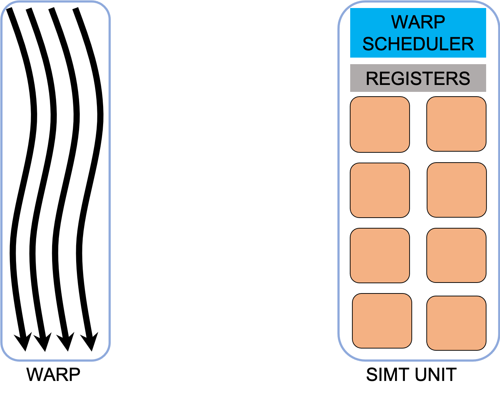
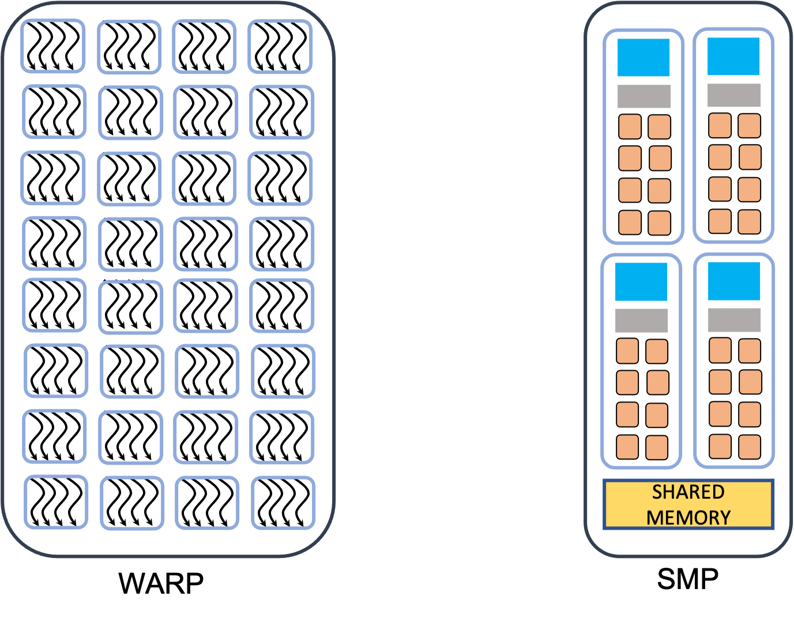

.. _gpu-concepts:

GPU programming concepts
========================

.. questions::

   - q1
   - q2

.. objectives::

   - o1
   - o2

.. instructor-note::

   - X min teaching
   - X min exercises

Different types of parallelism
------------------------------

Distributed- vs. Shared-Memory Architecture
~~~~~~~~~~~~~~~~~~~~~~~~~~~~~~~~~~~~~~~~~~~

Most of computing problems are not trivially parallelizable, which means that the subtasks 
need to have access from time to time to some of the results computed by other subtasks. 
The way subtasks exchange needed information depends on the available hardware.

.. figure:: img/history/distributed_vs_shared.png
   :align: center
   
   Distributed- vs shared-memory parallel computing.

In a distributed memory environment each computing unit operates independently from the 
others. It has its own memory and it  **cannot** access the memory in other nodes. 
The communication is done via network and each computing unit runs a separate copy of the 
operating system. In a shared memory machine all computing units have access to the memory 
and can read or modify the variables within.

Processes and threads
~~~~~~~~~~~~~~~~~~~~~

The type of environment (distributed- or shared-memory) determines the programming model. 
There are two types of parallelism possible, process based and thread based. 

.. figure:: img/history/processes-threads.png
   :align: center

For distributed memory machines, a process-based parallel programming model is employed. 
The processes are independent execution units which have their *own memory* address spaces. 
They are created when the parallel program is started and they are only terminated at the 
end. The communication between them is done explicitly via message passing like MPI.

On the shared memory architectures it is possible to use a thread based parallelism.  
The threads are light execution units and can be created and destroyed at a relatively 
small cost. The threads have their own state information but they *share* the *same memory* 
adress space. When needed the communication is done though the shared memory. 

Both approaches have their advantages and disadvantages.  Distributed machines are 
relatively cheap to build and they  have an "infinite " capacity. In principle one could 
add more and more computing units. In practice the more computing units are used the more 
time consuming is the communication. The shared memory systems can achive good performance 
and the programing model is quite simple. However they are limited by the memory capacity 
and by the access speed. In addition in the shared parallel model it is much easier to 
create race conditions.

Exposing parallelism
--------------------

The are two types of parallelism tha can be explored.
The data parallelism is when the data can be distributed across computational units that can run in parallel.
They than process the data applying the same or very simular operation to diffenet data elements.
A common example is applying a blur filter to an image --- the same function is applied to all the pixels on the image.
This parallelism is natural for the GPU, where the same instruction set is executed in multiple :term:`threads <thread>`.

.. figure:: img/concepts/ENCCS-OpenACC-CUDA_TaskParallelism_Explanation.png
    :align: center
    :scale: 40 %

    Data parallelism and task parallelism.
    The data parallelism is when the same operation applies to multiple data (e.g. multiple elements of an array are transformed).
    The task parallelism implies that there are more than one independent task that, in principle, can be executed in parallel.

Data parallelism can usually be explored by the GPUs quite easily.
The most basic approach would be finding a loop over many data elements and converting it into a GPU kernel.
If the number of elements in the data set if fairly large (tens or hundred of thousands elements), the GPU should perform quite well.
Although it would be odd to expect absolute maximum performance from such a naive approach, it is often the one to take.
Getting absolute maximum out of the data parallelism requires good understanding of how GPU works.

Another type of parallelism is a task parallelism.
This is when an application consists of more than one task that requiring to perform different operations with (the same or) different data.
An example of task parallelism is cooking: slicing vegetables and grilling are very different tasks and can be done at the same time.
Note that the tasks can consume totally different resources, which also can be explored.

GPU Execution Model
-------------------

In order to obtain maximum performance it is important to understand how GPUs execute the programs. As mentioned before a CPU is a flexible device oriented towards general purpose usage. It's fast and versatile, designed to run operating systems and various, very different types of applications. It has lots of features, such as better control logic, caches and cache coherence, that are not related to pure computing. CPUs optimize the execution by trying to achieve low latency via heavy caching and branch prediction. 

In contrast the GPUs contain a relatively small amount of transistors dedicated to control and caching, and a much larger fraction of transistors dedicated to the mathematical operations. Since the cores in a GPU are designed just for 3D graphics, they can be made much simpler and there can be a very larger number of cores. The current GPUs contain thousands of cuda cores. Performance in GPUs is obtain by having a very high degree of parallelism. Lots of threads are launched in parallel. For good performance there should be at least several times more than the number of cuda cores. The cuda threads are much lighter than the usual CPU threads and they have very little penalty for context switching. This way when some threads are performing some memory operations (reading or writing) others execute instructions. 

CUDA Threads, Warps, Blocks
~~~~~~~~~~~~~~~~~~~~~~~~~~~

In order to perform some work the program launches a function called *kernel*, which is executed simultaneously by tens of thousands of CUDA threads that can be run on CUDA cores parallelly. The cuda threads are much lighter than the usual CPU threads and they have very little penalty for context switching. By "over-subscribing"  the GPU there are threads that are performing some memory operations (reading or writing), while others execute instructions.  

.. figure:: img/concepts/THREAD_CORE.png
    :align: center
    :scale: 40 %

Every cuda thread is associated with a particular intrinsic index which can be used to calculate and access  memory locations in an array. Each CUDA thread has its context and set of private variables. All threads have access to the global GPU memory, but there is no general way to synchronized when executing a kernel. If some threads need data from the global memory which was modified by other threads the code would have to be splitted in several kernels because only at the completion of a kernel it is ensured that the writing to the global memory was completed.  

Apart from being much light weighted there are more differences between CUDA threads and CPU threads. The CUDA threads are grouped together in groups call *warps*. This done at harfware level. 

There are 2 very important aspects to this model of execution. **Firstly** all member of a warp have to execute the same instruction. This is a Single Instruction Multiple Threads (SIMT) model and also a Single Instruction Multiple Data (SIMD) model. This is done to achieve higher performance, but there are some drawbacks. If a an **if** statement is present inside a warp will cause the warp to be executed more than once, one time for each branch.

This execution model is needed because of the way the GPUs are built. The CUDA cores are very light computing units grouped togheter in so called SIMT units. A warp is executed by a SMT unit and it can not be splitted.

**Secondly** all memory accesses to the GPU memory are as a group in blocks of spefic sizes (32B, 64B, 128B etc.). To obtain good performance the CUDA threads in the same warp need to access elements of the data which are adjacent in the memory. This is called *coalesced* memory access. Finally  all threads part of a warp are synchronized. Some data sharing between the threads inside a warp is possible, however this is artchitecture dependent. 

There is another level in the CUDA threads hierarchy. The warps are grouped togheter in so called *blocks*. Each block is assigned to one Streaming Multiprocessor (SMP) unit. A SMP contains one or more SIMT units, schedulers, and very fast on-chip memory. Some of this on-chip memory can be used in the programers as a user controled cache which is accesable by all the threads in a block. In CUDA this is called *shared memory*. The share memory is used to "cache" data that is used by more than one CUDA thread, thus avoiding multiple reads from the global memory or it can be used to avoid memory accesses which are not efficient. For example in a matrix transpose operation, we have two memory operations per element and only can be coalesced. In the first step a tile of the matrix is saved read a coalesced manner in the shared memory. After all the reads of the block are done the tile can be locally transposed (which is very fast) and then written to the destination matrix in coalesced manner as well. All CUDA threads can be synchronized at block level. Furthermore when the shared memory is written in order to ensure that all threads have completed the operation the synchrozation is compulsory to ensure correctness of the program.

Finally, a block of threads can not be splitted among SMPs. For performance blocks should have more than a warp. The more warps are active on an SMP the better is hidden the latency associated with the memory operations. If the resources are suficient, due to fast context swithcing, an SMP can have more than one block active in the same time. However these blocks can not share data with each other via the on-chip memory.

To summarize this section. In order to take advantage of GPUs the algorithms must allow the division of work in many small subtasks which can be executed in the same time.  The computations are offloaded to GPUs, by launching tens of thousands of threads all executing the same function, *kernel*, each thread working on different part of the problem. The threads are executed in groups called *blocks*, each block being assigned to a SMP. Furthermore the threads of a block are divided in *warps*, each executed by SIMT unit. All threads in a warp execute the same instructions and all memory accesses are done collectively at warp level. The threads can synchronize and shared data only at block level. Depending on the architecture, some data sharing can be done as well at warp level. In order to hide latencies it is recommended to "over-subscribe" the GPU. There should be many more blocks than SMPs presen on the device. Also in order to ensure a good occupancy of the cuda cores there should be more warps active on a given SMP than SIMT units. This way while some warps of threads are idle waiting for some memory operations to complete, others use the cuda cores, thus ensuring a high occupancy of the GPU.

Terminology
-----------

At the moment there are three GPU producers Nvidia, Intel, and AMD. While the basic concept behind GPUs is pretty similar they use different names for the various parts. Furthermore there are software environments for programming GPUs, some from the producers and some from external groups all having different naming as well. Below there is a short compilation of the some terms used across different platforms and software environments.

Software
~~~~~~~~

.. list-table:: Software mapping naming
   :widths: 25 25 50
   :header-rows: 1

   * - CUDA
     - HIP
     - SYCL
   * - grid of threads
     - grid of threads
     - NDRange
   * - block
     - block
     - work-group
   * - warp
     - wavefront
     - sub-group
   * - thread
     - thread
     - work-item
   * - shared memory
     - local data share
     - local memory 
   * - registers
     - 
     - private memory
   * - threadIdx.\{x,y,x\},BlockIdx.\{x,y,x\}, BlockDim.\{x,y,x\}
     - threadIdx.\{x,y,x\},BlockIdx.\{x,y,x\}, BlockDim.\{x,y,x\}
     - nd_item::get_local(\{0,1,2\}), nd_item::get_group(\{0,1,2\}), nd_item::get_local(\{0,1,2\})

Hardware
~~~~~~~~

.. list-table:: Hardware
   :widths: 25 25 50
   :header-rows: 1

   * - Nvidia
     - AMD
     - Intel
   * - streaming processor
     - SIMD lane
     - 
   * - SIMT unit
     - SIMD unit
     - 
   * - streaming multiprocessor
     - computing unit 
     - execution unit

.. keypoints::

   - k1
   - k2
