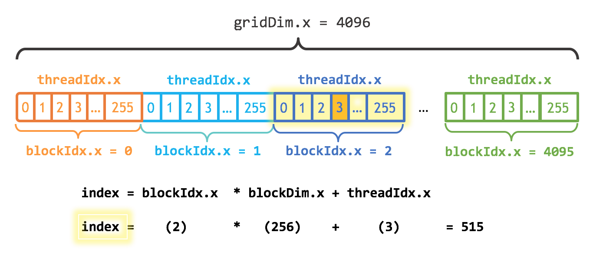

.. _gpu-concepts:

GPU programming concepts
========================

.. questions::

   - What types of parallel computing is possible?
   - How does data parallelism differ from task parallelism, and how are they utilized in parallel computing?
   - How is the work parallelized and executed on GPUs?
   - What are general considerations for an efficient code running on GPUs?

.. objectives::

   - Understand parallel computing principles and architectures.
   - Differentiate data parallelism from task parallelism. 
   - Learn the GPU execution model.
   - Parallelize and execute work on GPUs.
   - Develop efficient GPU code for high performance.

.. instructor-note::

   - 25 min teaching
   - 0 min exercises

Different types of parallelism
------------------------------

Distributed- vs. Shared-Memory Architecture
~~~~~~~~~~~~~~~~~~~~~~~~~~~~~~~~~~~~~~~~~~~

Most of computing problems are not trivially parallelizable, which means that the subtasks 
need to have access from time to time to some of the results computed by other subtasks. 
The way subtasks exchange needed information depends on the available hardware.

.. figure:: img/history/distributed_vs_shared.png
   :align: center
   
   Distributed- vs shared-memory parallel computing.

In a distributed memory environment each computing unit operates independently from the 
others. It has its own memory and it  **cannot** access the memory in other nodes. 
The communication is done via network and each computing unit runs a separate copy of the 
operating system. In a shared memory machine all computing units have access to the memory 
and can read or modify the variables within.

Processes and threads
~~~~~~~~~~~~~~~~~~~~~

The type of environment (distributed- or shared-memory) determines the programming model. 
There are two types of parallelism possible, process based and thread based. 

.. figure:: img/history/processes-threads.png
   :align: center

For distributed memory machines, a process-based parallel programming model is employed. 
The processes are independent execution units which have their *own memory* address spaces. 
They are created when the parallel program is started and they are only terminated at the 
end. The communication between them is done explicitly via message passing like MPI.

On the shared memory architectures it is possible to use a thread based parallelism.  
The threads are light execution units and can be created and destroyed at a relatively 
small cost. The threads have their own state information but they *share* the *same memory* 
address space. When needed the communication is done though the shared memory. 

Both approaches have their advantages and disadvantages.  Distributed machines are 
relatively cheap to build and they  have an "infinite " capacity. In principle one could 
add more and more computing units. In practice the more computing units are used the more 
time consuming is the communication. The shared memory systems can achieve good performance 
and the programming model is quite simple. However they are limited by the memory capacity 
and by the access speed. In addition in the shared parallel model it is much easier to 
create race conditions.

Exposing parallelism
--------------------

There are two types of parallelism that can be explored.
The data parallelism is when the data can be distributed across computational units that can run in parallel.
The units process the data by applying the same or very similar operation to different data elements.
A common example is applying a blur filter to an image --- the same function is applied to all the pixels on an image.
This parallelism is natural for the GPU, where the same instruction set is executed in multiple :abbr:`threads`.

.. figure:: img/concepts/ENCCS-OpenACC-CUDA_TaskParallelism_Explanation.png
    :align: center
    :scale: 40 %

    Data parallelism and task parallelism.
    The data parallelism is when the same operation applies to multiple data (e.g. multiple elements of an array are transformed).
    The task parallelism implies that there are more than one independent task that, in principle, can be executed in parallel.

Data parallelism can usually be explored by the GPUs quite easily.
The most basic approach would be finding a loop over many data elements and converting it into a GPU kernel.
If the number of elements in the data set is fairly large (tens or hundred of thousands elements), the GPU should perform quite well. Although it would be odd to expect absolute maximum performance from such a naive approach, it is often the one to take. Getting absolute maximum out of the data parallelism requires good understanding of how GPU works.

Another type of parallelism is a task parallelism.
This is when an application consists of more than one task that requiring to perform different operations with (the same or) different data.
An example of task parallelism is cooking: slicing vegetables and grilling are very different tasks and can be done at the same time.
Note that the tasks can consume totally different resources, which also can be explored.

.. admonition:: In short
   :class: dropdown

   - Computing problems can be parallelized in distributed memory or shared memory architectures.
   - In distributed memory, each unit operates independently, with no direct memory access between nodes.
   - In shared memory, units have access to the same memory and can communicate through shared variables.
   - Parallel programming can be process-based (distributed memory) or thread-based (shared memory).
   - Process-based parallelism uses independent processes with separate memory spaces and explicit message passing.
   - Thread-based parallelism uses lightweight threads that share the same memory space and communicate through shared memory.
   - Data parallelism distributes data across computational units, processing them with the same or similar operations.
   - Task parallelism involves multiple independent tasks that perform different operations on the same or different data.
   - Task parallelism involves executing different tasks concurrently, leveraging different resources.
   
GPU Execution Model
-------------------

In order to obtain maximum performance it is important to understand how GPUs execute the programs. As mentioned before a CPU is a flexible device oriented towards general purpose usage. It's fast and versatile, designed to run operating systems and various, very different types of applications. It has lots of features, such as better control logic, caches and cache coherence, that are not related to pure computing. CPUs optimize the execution by trying to achieve low latency via heavy caching and branch prediction. 

.. figure:: img/concepts/cpu-gpu-highway.png
    :align: center
    :scale: 40 %

    Cars and roads analogy for the CPU and GPU behavior. The compact road is analogous to the CPU
    (low latency, low throughput) and the broader road is analogous to the GPU (high latency, high throughput).

In contrast the GPUs contain a relatively small amount of transistors dedicated to control and caching, and a much larger fraction of transistors dedicated to the mathematical operations. Since the cores in a GPU are designed just for 3D graphics, they can be made much simpler and there can be a very larger number of cores. The current GPUs contain thousands of CUDA cores. Performance in GPUs is obtain by having a very high degree of parallelism. Lots of threads are launched in parallel. For good performance there should be at least several times more than the number of CUDA cores. GPU :abbr:`threads` are much lighter than the usual CPU threads and they have very little penalty for context switching. This way when some threads are performing some memory operations (reading or writing) others execute instructions.

CUDA Threads, Warps, Blocks
~~~~~~~~~~~~~~~~~~~~~~~~~~~

In order to perform some work the program launches a function called *kernel*, which is executed simultaneously by tens of thousands of :abbr:`threads` that can be run on GPU cores parallelly. GPU threads are much lighter than the usual CPU threads and they have very little penalty for context switching. By "over-subscribing" the GPU there are threads that are performing some memory operations (reading or writing), while others execute instructions.  

.. figure:: img/concepts/THREAD_CORE.png
    :align: center
    :scale: 40 %

Every :abbr:`thread` is associated with a particular intrinsic index which can be used to calculate and access  memory locations in an array. Each thread has its context and set of private variables. All threads have access to the global GPU memory, but there is no general way to synchronize when executing a kernel. If some threads need data from the global memory which was modified by other threads the code would have to be splitted in several kernels because only at the completion of a kernel it is ensured that the writing to the global memory was completed.  

Apart from being much light weighted there are more differences between GPU threads and CPU threads. GPU :abbr:`threads` are grouped together in groups called :abbr:`warps`. This done at hardware level. 

.. figure:: img/concepts/WARP_SMTU.png
    :align: center
    :scale: 40 %
    
    
All memory accesses to the GPU memory are as a group in blocks of specific sizes (32B, 64B, 128B etc.). To obtain good performance the CUDA threads in the same warp need to access elements of the data which are adjacent in the memory. This is called *coalesced* memory access.

On some architectures, all members of a :abbr:`warp` have to execute the 
same instruction, the so-called "lock-step" execution. This is done to achieve 
higher performance, but there are some drawbacks. If an **if** statement 
is present inside a :abbr:`warp` will cause the warp to be executed more than once, 
one time for each branch. When different threads within a single :abbr:`warp`
take different execution paths based on a conditional statement (if), both
branches are executed sequentially, with some threads being active while
others are inactive. On architectures without lock-step execution, such 
as NVIDIA Volta / Turing (e.g., GeForce 16xx-series) or newer, :abbr:`warp`
divergence is less costly.

There is another level in the GPU :abbr:`threads` hierarchy. The :abbr:`threads` are grouped together in so called :abbr:`blocks`. Each block is assigned to one Streaming Multiprocessor (SMP) unit. A SMP contains one or more SIMT (single instruction multiple threads) units, schedulers, and very fast on-chip memory. Some of this on-chip memory can be used in the programs, this is called :abbr:`shared memory`. The shared memory can be used to "cache" data that is used by more than one thread, thus avoiding multiple reads from the global memory. It can also be used to avoid memory accesses which are not efficient. For example in a matrix transpose operation, we have two memory operations per element and only can be coalesced. In the first step a tile of the matrix is saved read a coalesced manner in the shared memory. After all the reads of the block are done the tile can be locally transposed (which is very fast) and then written to the destination matrix in a coalesced manner as well. Shared memory can also be used to perform block-level reductions and similar collective operations. All threads can be synchronized at block level. Furthermore when the shared memory is written in order to ensure that all threads have completed the operation the synchronization is compulsory to ensure correctness of the program.

.. figure:: img/concepts/BLOCK_SMP.png
    :align: center
    :scale: 40 %

Finally, a block of threads can not be splitted among SMPs. For performance blocks should have more than one :abbr:`warp`. The more warps are active on an SMP the better is hidden the latency associated with the memory operations. If the resources are sufficient, due to fast context switching, an SMP can have more than one block active in the same time. However these blocks can not share data with each other via the on-chip memory.

To summarize this section. In order to take advantage of GPUs the algorithms must allow the division of work in many small subtasks which can be executed in the same time. The computations are offloaded to GPUs, by launching tens of thousands of threads all executing the same function, *kernel*, each thread working on different part of the problem. The threads are executed in groups called *blocks*, each block being assigned to a SMP. Furthermore the threads of a block are divided in *warps*, each executed by SIMT unit. All threads in a warp execute the same instructions and all memory accesses are done collectively at warp level. The threads can synchronize and share data only at block level. Depending on the architecture, some data sharing can be done as well at warp level. 

In order to hide latencies it is recommended to "over-subscribe" the GPU. There should be many more blocks than SMPs present on the device. Also in order to ensure a good occupancy of the CUDA cores there should be more warps active on a given SMP than SIMT units. This way while some warps of threads are idle waiting for some memory operations to complete, others use the CUDA cores, thus ensuring a high occupancy of the GPU.

In addition to this there are some architecture-specific features of which the developers can take advantage. :abbr:`Warp`-level operations are primitives provided by the GPU architecture to allow for efficient communication and synchronization within a warp. They allow :abbr:`threads` within a warp to exchange data efficiently, without the need for explicit synchronization. These warp-level operations, combined with the organization of threads into blocks and clusters, make it possible to implement complex algorithms and achieve high performance on the GPU. The cooperative groups feature introduced in recent versions of CUDA provides even finer-grained control over thread execution, allowing for even more efficient processing by giving more flexibility to the thread hierarchy. Cooperative groups allow threads within a block to organize themselves into smaller groups, called cooperative groups, and to synchronize their execution and share data within the group.

Below there is an example of how the threads in a grid can be associated with specific elements of an array

The thread marked by orange color is part of a grid of threads size 4096. The threads are grouped in blocks of size 256. The "orange" thread has index 3 in the block 2 and the global calculated index 515.

For a vector addition example this would be used as follow ``c[index]=a[index]+b[index]``.

.. admonition:: In short
   :class: dropdown

   - GPUs have a different execution model compared to CPUs, with a focus on parallelism and mathematical operations.
   - GPUs consist of thousands of lightweight threads that can be executed simultaneously on GPU cores.
   - Threads are organized into warps, and warps are grouped into blocks assigned to streaming multiprocessors (SMPs).
   - GPUs achieve performance through high degrees of parallelism and efficient memory access.
   - Shared memory can be used to cache data and improve memory access efficiency within a block.
   - Synchronization and data sharing are limited to the block level, with some possible sharing at the warp level depending on the architecture.
   - Over-subscribing the GPU and maximizing warp and block occupancy help hide latencies and improve performance.
   - Warp-level operations and cooperative groups provide efficient communication and synchronization within a warp or block.
   - Thread indexing allows associating threads with specific elements in an array for parallel processing.

Terminology
-----------

At the moment there are three major GPU producers: NVIDIA, Intel, and AMD. While the basic concept behind GPUs is pretty similar they use different names for the various parts. Furthermore there are software environments for GPU programming, some from the producers and some from external groups all having different naming as well. Below there is a short compilation of the some terms used across different platforms and software environments.

Software
~~~~~~~~

.. table:: Software mapping naming
   :align: center

   +-------------------------+-------------------------+---------------------------+---------------------------------------------------+
   | CUDA                    | HIP                     | OpenCL                    | SYCL                                              |
   +=========================+=========================+===========================+===================================================+
   | grid of threads                                   | NDRange                                                                       |
   +-------------------------+-------------------------+---------------------------+---------------------------------------------------+
   | block                                             | work-group                                                                    |
   +-------------------------+-------------------------+---------------------------+---------------------------------------------------+
   | warp                    | wavefront               | sub-group                                                                     |
   +-------------------------+-------------------------+---------------------------+---------------------------------------------------+
   | thread                                            | work-item                                                                     |
   +-------------------------+-------------------------+---------------------------+---------------------------------------------------+
   | registers                                         | private memory                                                                |
   +-------------------------+-------------------------+---------------------------+---------------------------------------------------+
   | shared memory           | local data share        | local memory                                                                  |
   +-------------------------+-------------------------+---------------------------+---------------------------------------------------+
   | threadIdx.\{x,y,z\}                               | get_local_id(\{0,1,2\})   | nd_item::get_local(\{2,1,0\}) [#syclindex]_       |
   +-------------------------+-------------------------+---------------------------+---------------------------------------------------+
   | blockIdx.\{x,y,z\}                                | get_group_id(\{0,1,2\})   | nd_item::get_group(\{2,1,0\}) [#syclindex]_       |
   +-------------------------+-------------------------+---------------------------+---------------------------------------------------+
   | blockDim.\{x,y,z\}                                | get_local_size(\{0,1,2\}) | nd_item::get_local_range(\{2,1,0\}) [#syclindex]_ |
   +-------------------------+-------------------------+---------------------------+---------------------------------------------------+

.. [#syclindex] In SYCL, the thread indexing is inverted. In a 3D grid, physically adjacent threads have consecutive X (0) index in CUDA, HIP, and OpenCL, but consecutive Z (2) index in SYCL. 
   In a 2D grid, CUDA, HIP, and OpenCL still has contiguous indexing along X (0) dimension, while in SYCL it is Y (1).
   Same applies to block dimensions and indexing. 

Exercises
---------

.. challenge:: What are threads in the context of shared memory architectures?

   a) Independent execution units with their own memory address spaces
   b) Light execution units with shared memory address spaces
   c) Communication devices between separate memory units
   d) Programming models for distributed memory machines

   .. solution::

      Correct answer:  *b) Light execution units with shared memory address spaces*

.. challenge:: What is data parallelism?

   a) Distributing data across computational units that run in parallel, applying the same or similar operations to different data elements.
   b) Distributing tasks across computational units that run in parallel, applying different operations to the same data elements.
   c) Distributing data across computational units that run sequentially, applying the same operation to all data elements.
   d) Distributing tasks across computational units that run sequentially, applying different operations to different data elements.

   .. solution::

      Correct answer: *a) Distributing data across computational units that run in parallel, applying the same or similar operations to different data elements.*

.. challenge:: What type of parallelism is natural for GPU?

   a) Task Parallelism
   b) Data Parallelism
   c) Both data and task parallelism
   d) Neither data nor task parallelism

   .. solution::
      
      Correct answer: *b) Data Parallelism*

.. challenge:: What is a kernel in the context of GPU execution?

   a) A specific section of the CPU used for memory operations.
   b) A specific section of the GPU used for memory operations.
   c) A type of thread that operates on the GPU.
   d) A function that is executed simultaneously by tens of thousands of threads on GPU cores.   

   .. solution:: 

      Correct answer: *d) A function that is executed simultaneously by tens of thousands of threads on GPU cores.*

.. challenge:: What is coalesced memory access?

   a) It's when CUDA threads in the same warp access elements of the data which are adjacent in the memory.
   b) It's when CUDA threads in different warps access elements of the data which are far in the memory.
   c) It's when all threads have access to the global GPU memory.
   d) It's when threads in a warp perform different operations.

   .. solution::

      Correct answer: *a) It's when CUDA threads in the same warp access elements of the data which are adjacent in the memory.*

.. challenge:: What is the function of shared memory in the context of GPU execution?

   a) It's used to store global memory.
   b) It's used to store all the threads in a block.
   c) It can be used to "cache" data that is used by more than one thread, avoiding multiple reads from the global memory.
   d) It's used to store all the CUDA cores.

   .. solution::

      Correct answer: *c) It can be used to "cache" data that is used by more than one thread, avoiding multiple reads from the global memory.*

.. challenge:: What is the significance of over-subscribing the GPU?

   a) It reduces the overall performance of the GPU.
   b) It ensures that there are more blocks than SMPs present on the device, helping to hide latencies and ensure high occupancy of the GPU.
   c) It leads to a memory overflow in the GPU.
   d) It ensures that there are more SMPs than blocks present on the device.

   .. solution::

      Correct answer: *b) It ensures that there are more blocks than SMPs present on the device, helping to hide latencies and ensure high occupancy of the GPU.*

.. keypoints::

   - Parallel computing can be classified into distributed-memory and shared-memory architectures
   - Two types of parallelism that can be explored are data parallelism and task parallelism.
   - GPUs are a type of shared memory architecture suitable for data parallelism.
   - GPUs have high parallelism, with threads organized into warps and blocks and.
   - GPU optimization involves coalesced memory access, shared memory usage, and high thread and warp occupancy. Additionally, architecture-specific features such as warp-level operations and cooperative groups can be leveraged for more efficient processing.
